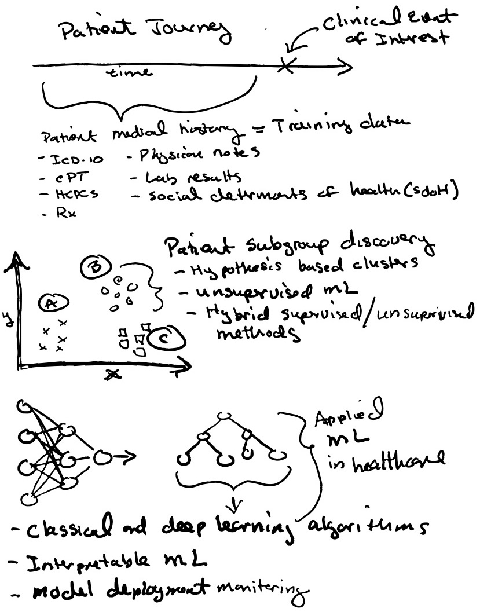
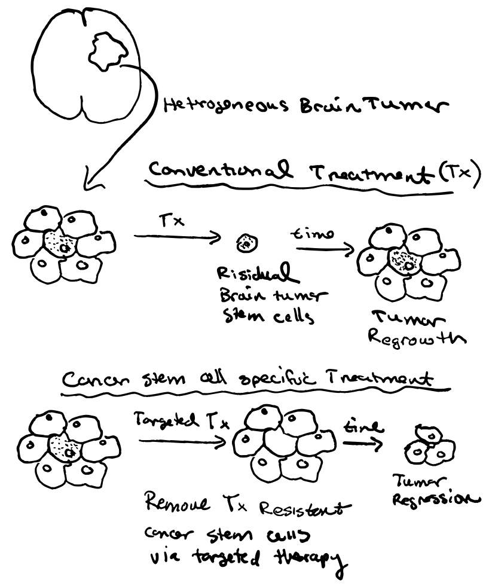
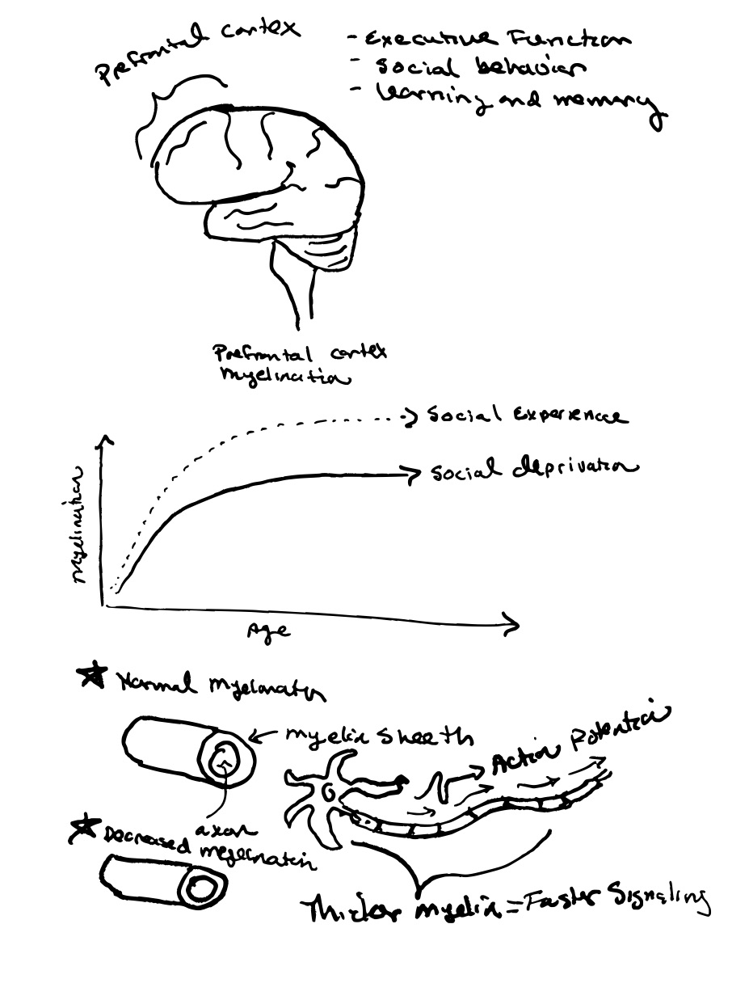

# Applied ML
Medical care is being transformed by advances in machine learning and the rising digitalization of health data. I am enthusiastic about contributing to this dynamic environment by encouraging creative, ethical innovation and mentoring the next generation of data specialists. In my current role, I work with an accomplished, multidisciplinary team of data scientists, engineers, consultants, and healthcare specialists to use RWD to accelerate the detection of rare and under-treated diseases and, ultimately, to improve patient health outcomes.
  

# Academic Work
I'm fascinated by the relationship between early brain development and human health and disease. My graduate research lab investigated the disruption of cellular developmental and metabolic processes in brain tumor pathogenesis. We also explored therapeutics that inhibit cancer growth by targeting metabolic and epigenetic pathways in brain tumor stem cells.

As a postdoctoral researcher, I explored how early life events might influence healthy brain function favorably or adversely. We focused on the impacts of adolescent social experience on myelin development in the prefrontal cortex, the portion of the brain responsible for higher level cognitive performance, as well as the influence of early life auditory experience on sound information processing in the auditory cortex.

