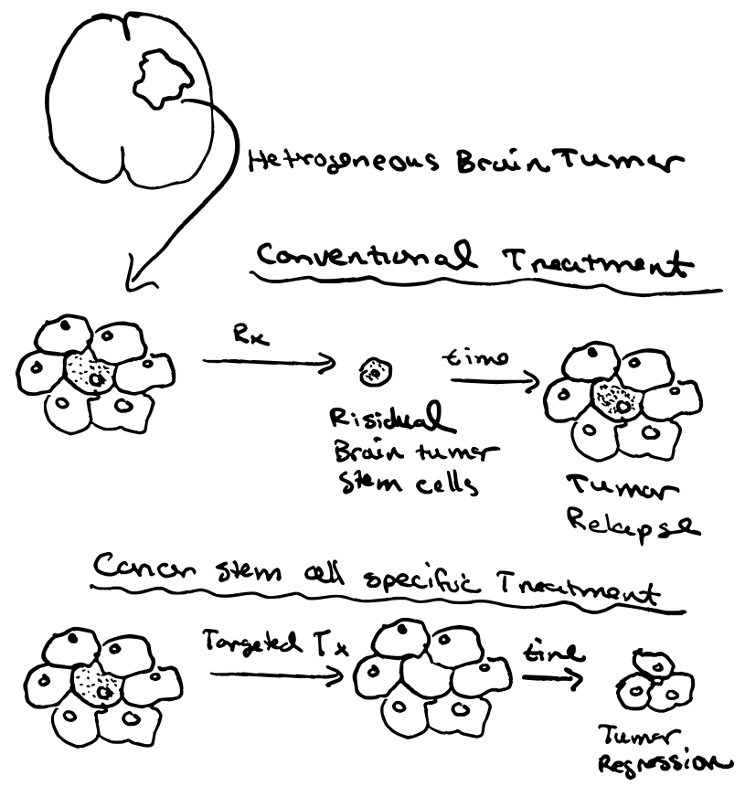

# Applied ML

# Academic Work

I am fascinated by the interaction between early life development and human health and disease. In my graduate studies, I focused on the disruption of cellular developmental processes in the development of brain tumors. Our lab investigated therapeutics that target metabolic and epigenetic pathways in brain tumor stem cells to induce growth arrest. 

As a postdoc, my research focused on early life experiences in promoting healthy brain function. Our lab investigated the role of adolescent social experiences on myelin maturation in the prefrontal cortex and the effects of early auditory experiences on the processing of sound information in the auditory cortex.

