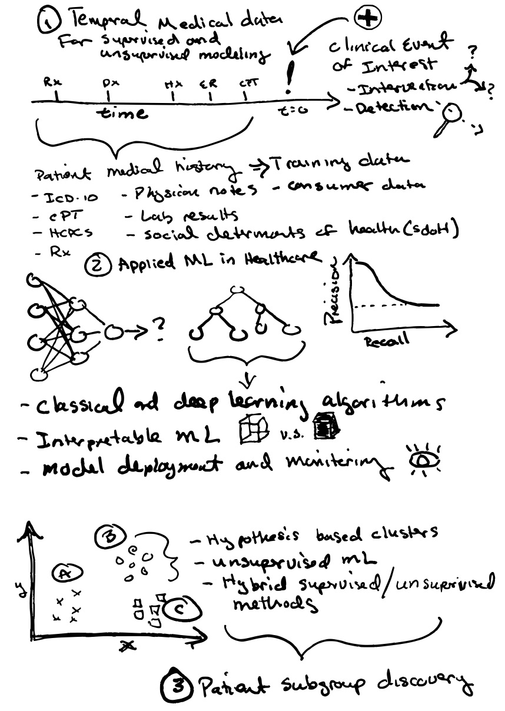

# Applying ML to Healthcare
Healthcare delivery is undergoing a significant transformation, fueled by the advancements in ML and the growing digitization of health data. My passion lies in shaping this vibrant landscape by fostering innovative, ethically-conscious ideas and nurturing the upcoming generation of data specialists. In my current role, I collaborate with a talented, multidisciplinary team comprising data scientists, engineers, consultants, and healthcare professionals. Together, we use RWD to expedite the detection of rare and under-treated diseases, ultimately aiming to enhance patient health outcomes.

Our toolkit includes a broad spectrum of ML methodologies to unlock the potential of RWD. This involves training supervised ML models on anonymized, longitudinal patient level data to predict the onset of rare diseases, thereby enabling proactive clinical intervention. Additionally, these models aid in identifying patients with unreported or under-diagnosed medical conditions, thereby bolstering the chances of effective treatment and improved prognosis. We also deploy unsupervised ML techniques to uncover clinically relevant patient subgroups, unmasking heterogeneity within patient populations. This paves the way for more personalized care and balanced clinical trial recruitment. To ensure optimal effectiveness, our ML solutions demand a rigorously designed methodology, clinical subject matter expertise, and a dedicated focus on Explainable Artificial Intelligence (XAI).

# Neuroscience Research
## Dystrupted Cellular Development and Energetics in Brain Cancer
I'm fascinated by the relationship between early brain development and human health and disease. My graduate research lab investigated the disruption of cellular developmental and metabolic processes in brain tumor pathogenesis. We also explored therapeutics that inhibit cancer growth by targeting metabolic and epigenetic pathways in brain tumor stem cells.

## The Impact of Sensory Experience on Neural Connnectivity 
During my postdoctoral fellowship, I explored how early life events might influence healthy brain function favorably or adversely. We focused on the impacts of adolescent social experience on myelin development in the prefrontal cortex, the portion of the brain responsible for higher level cognitive performance, as well as the influence of early life auditory experience on sound information processing in the auditory cortex.

